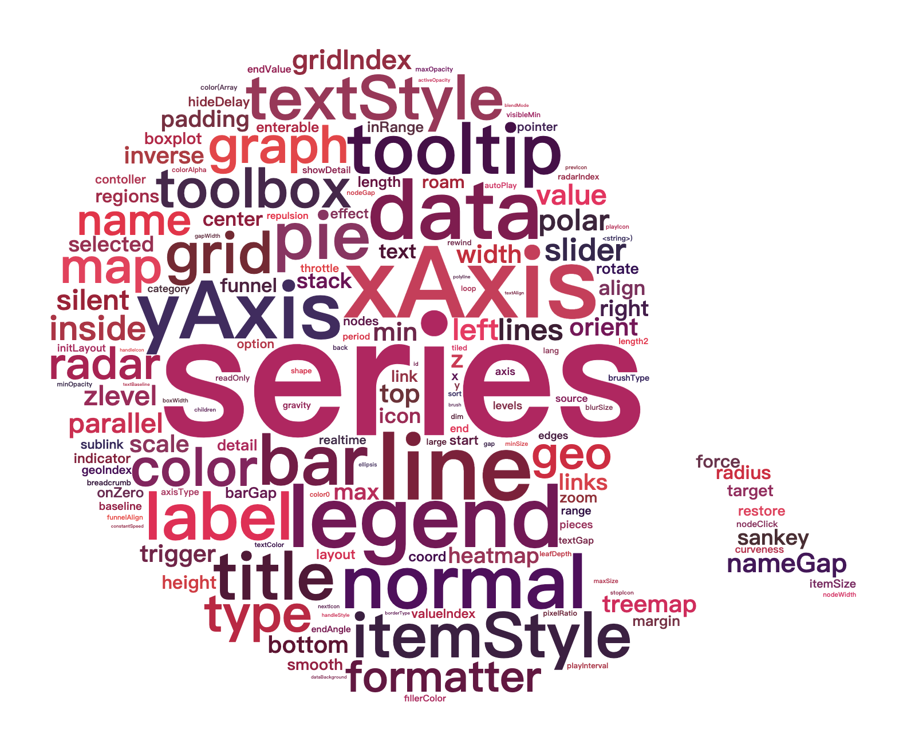

# [Apache ECharts (incubating)](https://github.com/apache/incubator-echarts) wordcloud extension based on [wordcloud2.js](https://github.com/timdream/wordcloud2.js)




## Examples

[Google Trends](https://ecomfe.github.io/echarts-wordcloud/example/wordCloud.html)

[ECharts Option Keywords](https://ecomfe.github.io/echarts-wordcloud/example/optionKeywords.html)

## Install

```html
<script src="echarts.min.js"></script>
<script src="echarts-wordcloud.min.js"></script>
```

Or

```shell
npm install echarts
npm install echarts-wordcloud
```

```js
import * as echarts from 'echarts'
import 'echarts-wordcloud';
```

## Usage

```js
var chart = echarts.init(document.getElementById('main'));

chart.setOption({
    ...
    series: [{
        type: 'wordCloud',

        // The shape of the "cloud" to draw. Can be any polar equation represented as a
        // callback function, or a keyword present. Available presents are circle (default),
        // cardioid (apple or heart shape curve, the most known polar equation), diamond (
        // alias of square), triangle-forward, triangle, (alias of triangle-upright, pentagon, and star.

        shape: 'circle',

        // A silhouette image which the white area will be excluded from drawing texts.
        // The shape option will continue to apply as the shape of the cloud to grow.

        maskImage: maskImage,

        // Folllowing left/top/width/height/right/bottom are used for positioning the word cloud
        // Default to be put in the center and has 75% x 80% size.

        left: 'center',
        top: 'center',
        width: '70%',
        height: '80%',
        right: null,
        bottom: null,

        // Text size range which the value in data will be mapped to.
        // Default to have minimum 12px and maximum 60px size.

        sizeRange: [12, 60],

        // Text rotation range and step in degree. Text will be rotated randomly in range [-90, 90] by rotationStep 45

        rotationRange: [-90, 90],
        rotationStep: 45,

        // size of the grid in pixels for marking the availability of the canvas
        // the larger the grid size, the bigger the gap between words.

        gridSize: 8,

        // set to true to allow word being draw partly outside of the canvas.
        // Allow word bigger than the size of the canvas to be drawn
        drawOutOfBound: false,

        // Global text style
        textStyle: {
            normal: {
                fontFamily: 'sans-serif',
                fontWeight: 'bold',
                // Color can be a callback function or a color string
                color: function () {
                    // Random color
                    return 'rgb(' + [
                        Math.round(Math.random() * 160),
                        Math.round(Math.random() * 160),
                        Math.round(Math.random() * 160)
                    ].join(',') + ')';
                }
            },
            emphasis: {
                shadowBlur: 10,
                shadowColor: '#333'
            }
        },

        // Data is an array. Each array item must have name and value property.
        data: [{
            name: 'Farrah Abraham',
            value: 366,
            // Style of single text
            textStyle: {
                normal: {},
                emphasis: {}
            }
        }]
    }]
});
```
